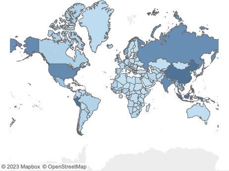

# Proyecto de visualización en Tableau acerca de la producción pesquera y acuicola 🐟

En los últimos años ha habido un boom de la acuicultura, principalmente como respuesta al problema de la sobrepesca y el agotamiento de los caladeros a nivel mundial. Sin embargo, la acuicultura no esta excenta de problemas medioambientales, ya que muchos de las especies presentes en granjas consumen mas carne de la que producen, ensucian las aguas colindantes y representan riesgos para las especies endémicas en caso de fuga.

Este proyecto trata de representar visualmente el crecimiento de la pesca y la acuicultura a nivel mundial y, mas concretamente, a nivel europeo. Para ello se obtuvo un archivo .csv con datos sobre la producción de ambas actividades medida en toneladas métricas por país entre los años 1960 y 2018. Para esta representación se uso la herramienta Tableau, en la cual se han creado mapas sobre la productividad de ambas actividades en cada país, así como gráficos de barras que representan ordenadamente aquellos países con mayor producción.

Tras visualizar los datos quedan patentes, principalmente, dos cuestiones. La primera de estas es la hegemonía china en ambas actividades, superando por mucho a calquier otro país. La segunda es que, pese al potencial uso de la acuicultura como protección de la biodiversidad, la acuicultura no ha producido un descenso en la pesca. Si se puede decir, sin embargo, que ha frenado la pesca, aumentando a lo largo de los años la producción acuicola pero no la pesquera.